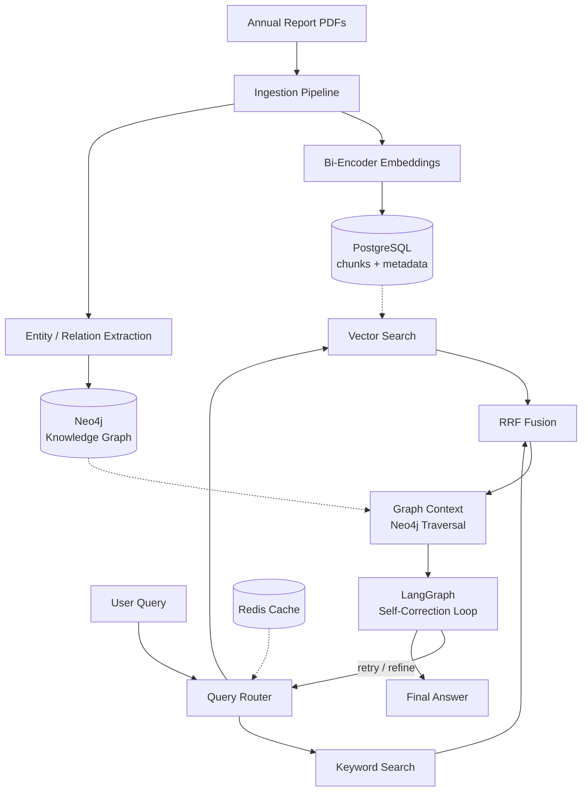

# finrag-adaptive

*Hybrid retrieval system for answering complex financial questions over Indian listed companies' annual reports — dense + sparse retrieval fused with RRF, a Neo4j knowledge graph, and a LangGraph self-correction loop that adaptively retries weak answers.*

> **Status: active development.** This README tracks the actual state of the codebase — see [Status & Roadmap](#status--roadmap) for what's built vs. planned.

## Overview

Indian listed-company annual reports are long, dense, and only partially structured — financials, MD&A narrative, subsidiary disclosures, and risk factors are all cross-referenced but rarely easy to query directly. Plain vector search struggles with the precision these documents demand: a question like *"how did segment revenue change relative to a peer across the last 3 filings"* needs both semantic retrieval and structured, relational context that flat chunk-based RAG doesn't give you.

This project addresses that with:

- **Hybrid retrieval** (dense + sparse), combined via **Reciprocal Rank Fusion (RRF)**
- A **query router** that sends each query down the right retrieval path
- A **Neo4j knowledge graph** capturing entities and relationships — subsidiaries, segments, metrics across periods — that flat chunk retrieval misses
- A **LangGraph self-correction loop** that validates an answer before returning it, and retries when it isn't good enough
- A **fine-tuned bi-encoder**, trained on hard negatives specific to financial language
- A **component-by-component ablation study** isolating exactly how much each piece contributes — this is the centerpiece of the eval

## Architecture



*First-pass diagram based on the planned pipeline, not traced from actual code yet — I'll tighten it once retrieval and correction are in and I can see the real call order.*

## Key Results

_Ablation table and retrieval metrics land here once evaluation is finalized. This is meant to be the centerpiece of the whole README, so it's getting its own real pass rather than filler numbers._

## Tech Stack

| Layer | Choice |
|---|---|
| API | FastAPI |
| Orchestration | LangChain + LangGraph (self-correction loop) |
| Relational DB | PostgreSQL (async, via SQLAlchemy 2.0) |
| Graph DB | Neo4j (async driver) |
| Cache | Redis |
| LLM Inference | Groq, Gemini, Together AI (multi-provider) |
| Embeddings | HuggingFace / PyTorch (fine-tuned bi-encoder) |
| Config | Pydantic Settings |
| Logging | structlog |
| Deployment | AWS |

## Project Structure

```
├── backend
│   └── app
│       ├── cache
│       ├── core
│       │   ├── config.py   # typed settings — see Core Infrastructure below
│       │   ├── logging.py  # structlog setup — see Core Infrastructure below
│       │   └── db          # connection managers — see Core Infrastructure below
│       ├── correction      # LangGraph self-correction loop
│       ├── eval
│       ├── ingestion
│       ├── main.py         # FastAPI app + lifespan
│       ├── retrieval       # hybrid search + RRF fusion
│       ├── routers         # FastAPI endpoints
│       └── services
│           └── embeddings  # bi-encoder fine-tuning
├── data
│   ├── processed
│   └── raw
└── eval
```

## Core Infrastructure

### Configuration — `backend/app/core/config.py`

Typed, validated configuration via `pydantic-settings`, loaded from a `.env` file. The LLM provider keys have no defaults, so the app fails fast at startup with a clear validation error if they're missing, rather than failing later the first time a provider is actually called. `ASYNC_POSTGRES_URI` is a computed `@property` built from the individual Postgres fields rather than a raw connection-string env var — keeps `.env` readable and avoids hand-formatting a DSN.

### Database Layer — `backend/app/core/db/`

| Class | Responsibility | Key Design Decision |
|---|---|---|
| `Neo4jDatabaseManager` | Owns the async Neo4j driver; yields graph sessions | Singleton, so the connection pool survives across requests instead of rebuilding per call. `get_session()` is deliberately an async generator rather than a plain method — that's what lets it plug directly into FastAPI's dependency system for automatic per-request cleanup. |
| `PostgresManager` | Owns the async SQLAlchemy engine + session factory; yields relational sessions | Same singleton + async-generator pattern, so both database layers behave consistently from the caller's side. |
| `RedisManager` | Owns the async Redis connection pool; yields Redis client sessions for caching | Pool creation is a separate, explicit `connect()` call rather than happening in `__new__` like the other two — needs to be called once at app startup (e.g. a FastAPI lifespan hook) before `get_session()` will work; raises a clear `RuntimeError` otherwise. |

**Usage (FastAPI route):**
```python
from fastapi import Depends
from backend.app.core.db.neo4j_manager import neo4j_db  # adjust to your actual filename

@router.get("/company/{ticker}")
async def get_company(ticker: str, session = Depends(neo4j_db.get_session)):
    result = await session.run(
        "MATCH (c:Company {ticker: $ticker}) RETURN c", ticker=ticker
    )
    return await result.data()
```

**Note:** all three `get_session()` methods are plain async generators — meant to be consumed via FastAPI's `Depends()` (as above), or outside a request context (ingestion/eval scripts) via `async for session in postgres_db.get_session():`. They do **not** support `async with x.get_session() as session:` directly; that protocol only works on methods wrapped with `@contextlib.asynccontextmanager`, which none of these are.

### Logging — `backend/app/core/logging.py`

Structured JSON logging via `structlog`, wired through `structlog.contextvars` so request-scoped context (like a request ID) automatically shows up on every log line emitted during that request, without threading it manually through every function call. JSON output rather than pretty-printed console output, since these logs need to be machine-parseable the moment this runs anywhere other than a local terminal.

## Getting Started

**Requirements:** Python 3.11+, and running instances of PostgreSQL, Neo4j, and Redis.

*(No Docker Compose yet — that's on the roadmap. For now this assumes services reachable at the hosts/ports set in your `.env`.)*

```bash
git clone <repo-url>
cd finrag-adaptive
python -m venv .venv
.venv\Scripts\activate      # macOS/Linux: source .venv/bin/activate
pip install -r requirements.txt
```

Create a `.env` in the project root:
```
# Required — no defaults, app won't start without these
GROQ_API_KEY=
GEMINI_API_KEY=
TOGETHER_API_KEY=

# Optional — defaults shown match config.py
POSTGRES_USER=postgres
POSTGRES_PASSWORD=postgres
POSTGRES_HOST=localhost
POSTGRES_PORT=5432
POSTGRES_DB=finrag

NEO4J_URI=neo4j://localhost:7687
NEO4J_USER=neo4j
NEO4J_PASSWORD=password

REDIS_HOST=localhost
REDIS_PORT=6379
```

Run the API:
```bash
uvicorn backend.app.main:app --reload
```

Confirm it's up:
```bash
curl http://localhost:8000/health
```
```json
{"status": "healthy", "latency_ms": 12.34, "project": "finrag-adaptive", "version": "1.0.0"}
```
Returns `503` instead of `200` if Postgres, Neo4j, or Redis fails to respond.

*That's `/health` only — `routers/` beyond this is still empty, so there's no `/query` endpoint yet.*

## Documentation

Deep dives live in their own files instead of bloating this one:

- `docs/ARCHITECTURE.md` — hybrid retrieval, RRF fusion, query router, KG design *(coming once retrieval is in)*
- `docs/EVALUATION.md` — ablation methodology + results *(coming once eval is finalized)*
- `docs/SELF_CORRECTION.md` — LangGraph correction loop *(coming once correction is in)*

## Status & Roadmap

**Built**
- [x] Async database layer — Neo4j + PostgreSQL + Redis connection management
- [x] Typed configuration via pydantic-settings
- [x] Structured JSON logging (structlog)
- [x] FastAPI app entrypoint with lifespan + health check

**Planned**
- [ ] Ingestion pipeline (chunking, embedding, entity/relation extraction)
- [ ] Hybrid retrieval (vector + keyword)
- [ ] RRF fusion + query router
- [ ] Neo4j knowledge graph construction
- [ ] LangGraph self-correction loop
- [ ] Bi-encoder fine-tuning on hard negatives
- [ ] Ablation evaluation
- [ ] Docker Compose for one-command local setup
- [ ] CI (lint, type-check, tests)